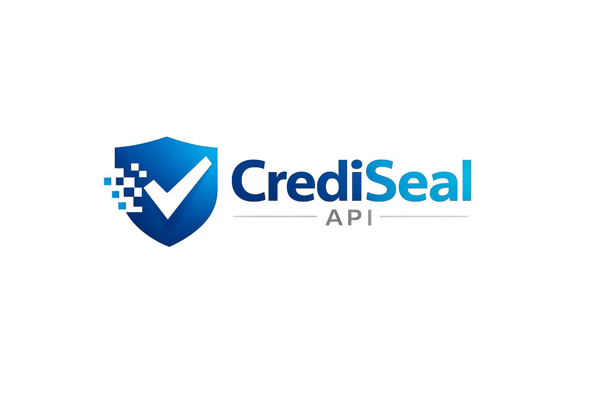

  

  <strong>CrediSeal API</strong> 
  API REST para emitir, verificar y gestionar credenciales digitales verificables con enfoque antifraude.

  <!-- Badges (ajusta TU_USUARIO, nombre del repo y el workflow) -->
  
  
  
  

  <a href="https://www.linkedin.com/in/maicol-duvan-gasca-rodas-4483923a4/?trk=public-profile-join-page" target="_blank">LinkedIn</a> •
  <a href="https://www.instagram.com/maicolddox_?utm_source=qr&igsh=cTV6enRlMW05bjY3" target="_blank">Instagram</a> •
  <a href="https://github.com/TU_USUARIO" target="_blank">GitHub</a> •
  <a href="https://discordapp.com/users/1425631850453270543" target="_blank">Discord</a> •
  <a href="mailto:maicolindustriascode@gmail.com" target="_blank">Email</a>

---

## Acerca de CrediSeal API

**CrediSeal API** es una API REST construida con **Laravel 12 + Sanctum** que permite a organizaciones (emisores) **emitir credenciales digitales verificables** (insignias/certificados) a usuarios (titulares), con **verificación pública**, **revocación con historial** y **auditoría** para garantizar trazabilidad y reducir fraude.

Este proyecto está diseñado para portafolio y demuestra:
- Autenticación por tokens con **Sanctum**
- Control de acceso por roles con **Spatie Laravel-Permission**
- Diseño de API orientado a seguridad
- Modelado de datos realista (organizaciones, plantillas, eventos, credenciales)
- Registro de verificaciones y auditoría de acciones críticas

---

## Características principales

- **Auth**: Registro / Login / Logout / manejo de tokens (Sanctum)
- **Organizaciones**: gestión de emisores y membresías
- **Eventos/Cursos**: contexto para emisión de credenciales
- **Plantillas**: flujo Borrador → Publicada
- **Emisión de credenciales**:
  - emisión individual
  - emisión masiva (batch)
- **Verificación pública** (sin autenticación) mediante `public_code`
- **Revocación** con motivo e historial
- **Auditoría** para acciones críticas (emitir, revocar, publicar, cambios de rol)
- Paginación, filtros y estructura consistente de respuestas

---

## Roles y permisos (máximo 3 roles)

### 1) Admin
- Administra organizaciones, ve auditoría global y configura reglas del sistema.

### 2) Issuer (Emisor)
- Crea eventos y plantillas, emite y revoca credenciales dentro de su organización.

### 3) Holder (Titular)
- Visualiza su “wallet” de credenciales y gestiona visibilidad/compartir (opcional).

> Los permisos se implementan con **Spatie Laravel-Permission** y se aplican en rutas/controladores.

---

## Análisis de base de datos (alto nivel)

Entidades principales:
- `users`
- `organizations`
- `organization_user` (membresías)
- `events`
- `credential_templates`
- `credentials` (incluye `public_code` único)
- `credential_revocations` (historial de revocación)
- `verification_logs` (opcional, tracking de verificaciones públicas)
- `audit_logs` (recomendado, acciones internas)

Reglas clave:
- `public_code` debe ser **único**
- Un emisor solo puede emitir dentro de su organización
- Una plantilla debe estar **publicada** para emitir credenciales
- Preferible usar **soft deletes** en entidades críticas (auditoría)

---

## Resumen de endpoints (guía)

> Nombres ilustrativos; ajusta a tus rutas reales.

### Autenticación (Sanctum)
- `POST /api/auth/register`
- `POST /api/auth/login`
- `POST /api/auth/logout`
- `GET  /api/auth/me`

### Organizaciones (Admin)
- `GET  /api/organizations`
- `POST /api/organizations`
- `PATCH /api/organizations/{id}`
- `POST /api/organizations/{id}/members` (asignar emisor)

### Eventos (Issuer)
- `GET  /api/events`
- `POST /api/events`
- `PATCH /api/events/{id}`

### Plantillas (Issuer/Admin)
- `GET  /api/templates`
- `POST /api/templates`
- `PATCH /api/templates/{id}`
- `POST /api/templates/{id}/publish`

### Credenciales (Issuer/Holder)
- `POST /api/credentials` (emitir una)
- `POST /api/credentials/batch` (emitir masivo)
- `GET  /api/credentials` (listar)
- `GET  /api/credentials/{id}` (detalle)
- `POST /api/credentials/{id}/revoke` (revocar)

### Verificación pública (sin auth)
- `GET /api/public/verify/{public_code}`

### Logs (Admin/Issuer)
- `GET /api/audit-logs`
- `GET /api/verification-logs` (opcional)

---

## Guía rápida de instalación (local)

### Requisitos
- PHP >= 8.2 (recomendado para Laravel 12)
- Composer
- MySQL / PostgreSQL
- (Opcional) Node.js si agregas tooling frontend

### Pasos
1. Clona el repositorio
2. Instala dependencias con Composer
3. Configura `.env`
4. Ejecuta migraciones (y seeders si aplican)
5. Levanta el servidor y prueba con Postman/Insomnia

> Flujo recomendado de prueba: register → login → issue credential → public verify → revoke.

---

## Documentación
- Colección Postman (recomendado): `docs/postman/crediseal.postman_collection.json`
- OpenAPI (opcional): `docs/openapi.yaml`

---

## Roadmap (opcional)
- [ ] OpenAPI + Swagger UI
- [ ] Exportación PDF de credenciales
- [ ] Webhooks (credencial emitida/revocada)
- [ ] Aprobación de plantillas por Admin
- [ ] Multi-tenant con aislamiento fuerte por organización

---

## Contribuciones
Si deseas contribuir:
1. Haz un fork del repositorio
2. Crea una rama feature
3. Abre un Pull Request con una descripción clara

---

## Seguridad
Si encuentras una vulnerabilidad de seguridad, repórtala de forma privada:
- Email: **maicolindustriascode@gmail.com**

---

## Licencia
Este proyecto se publica bajo licencia **MIT**.
Ver el archivo [LICENSE](LICENSE).
